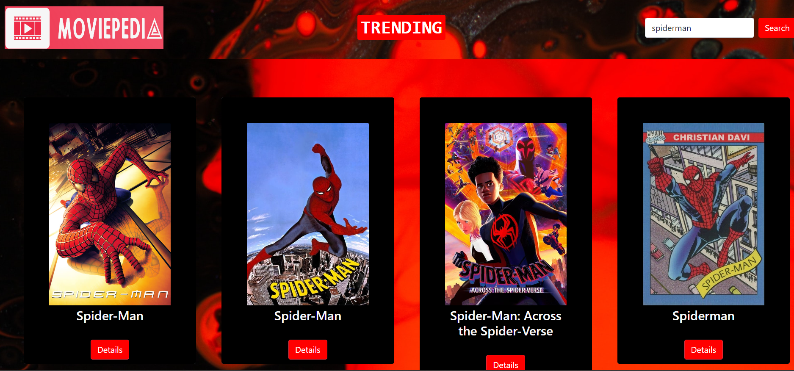

# Movie Search and Listing App

 <!-- Add a logo or relevant image here -->

A web application for searching and listing movies. This app allows users to search for movies by title and view detailed information about each movie.

## Table of Contents

- [Demo](#demo)
- [Features](#features)
- [Technologies](#technologies)
- [Usage](#usage)
- [Installation](#installation)


## Demo




[Live Demo](https://moviepedia1.netlify.app/)

## Features

- Search for movies by title.
- View detailed information about each movie, including poster, rating, release date, and more.
- Watch movie trailers if available.
- List top-rated and trending movies.

## Technologies

- React: Frontend library for building user interfaces.
- Bootstrap: CSS framework for styling.
- Themoviedb API: Used to fetch movie data.

## Usage
- Enter a movie title in the search bar and click "Search" to find a specific movie.
- Click on a movie card to view its details, including the poster, rating, release date, and more.
- Watch movie trailers if available.
- Explore top-rated and trending movies on the homepage.


## Installation

1. Clone the repository:

   ```bash
   git clone https://github.com/yourusername/movie-app.git
